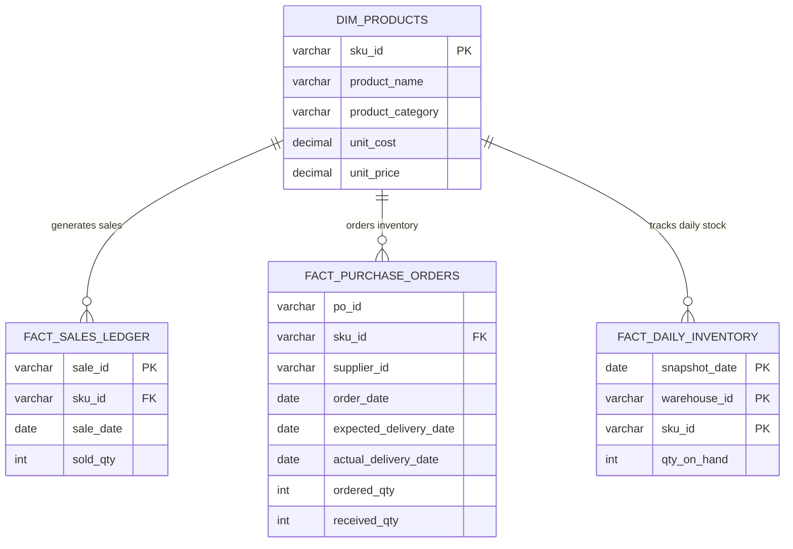
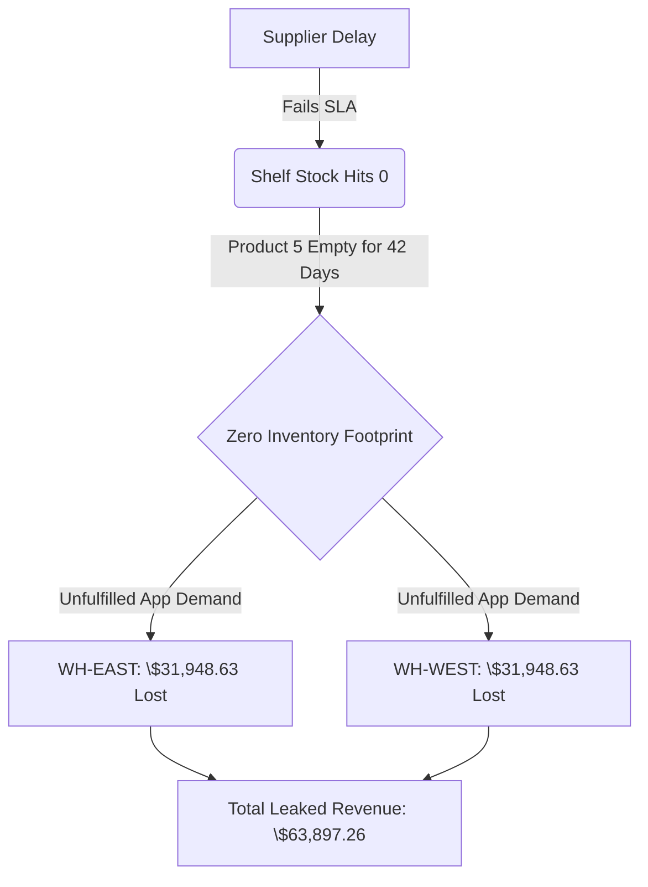

# OmniMarket Global: Procurement & Supply Chain Optimization Audit

##  The Business Scenario
**OmniMarket Global** is a multi-regional online storefront. The business model is simple: we buy 50 different products from 5 global manufacturing suppliers, store them in two major regional hubs (**WH-EAST** and **WH-WEST**), and sell them directly to customers on our app.

###  The Problem
Lately, the company has been facing a double-edged sword: net profit margins are shrinking, cash is tied up, and customers are complaining about out-of-stock items. Management suspects that we are holding too much slow-moving stock that wastes warehouse space, while simultaneous supplier delays are causing us to completely run out of our best-selling products.

To find out exactly what is going wrong, I used SQL to audit **17,646 operational records** spanning a 5-month window. The goal of this project is to expose unreliable suppliers, quantify exactly how much revenue we are losing due to empty shelves, and build an automated system to tell the warehouse exactly when to reorder stock.

---

##  Data Infrastructure & Database Design
The analytical pipeline connects raw database logs, sales ledger transactions, and daily warehouse inventory snapshots across four tables:

---

## 🔍 Key Findings & Analytical Insights

###  1. Supplier Performance: The Reliable vs. The Liabilities
My analysis shows that OmniMarket Global does not have a manufacturing issue, but a shipping and logistics bottleneck. Suppliers are capable of making the products, but their delivery timelines are highly unreliable.

* **The Top Performer:** *Alpha Logistics* is our best partner. They have a **67.86% Perfect OTIF (On-Time In-Full)** rate, zero average days of delay, and shorted only 33 units over 84 total orders.
* **The Operational Liability:** *Delta Corp* is a massive liability. They get deliveries right only **49.28%** of the time, are consistently late, and failed to deliver a total of **195 physical units** that we ordered. 

```mermaid
gantt
    title Vendor Delivery Reliability (Perfect OTIF %)
    dateFormat  X
    axisFormat %
    Alpha Logistics (67.86%) : active, 0, 68
    Gamma Global (62.89%)   : 0, 63
    Omega Distributing (59.72%) : 0, 60
    Beta Manufacturing (55.13%) : 0, 55
    Delta Corp (49.28%) : critical, 0, 49
```

###  2. ABC Inventory Tiers: Finding where Cash is Trapped
By using SQL window functions to calculate the cumulative revenue contribution of every single product, I grouped our 50-item catalog into three clear priority tiers:

* **Class A (The Power Drivers):** Just **23 core products** (mostly in Apparel and Automotive) generate **80% of our total revenue**, bringing in over \$66,000+ each. We must protect these shelves at all costs.
* **Class C (The Cash Drains):** Slow-moving items like *Product 30 (Home Goods)* brought in a pathetic **\$3,030.77** over 5 entire months. We are wasting valuable warehouse space storing products that do not move.

###  3. Stockout Impact: The Hidden Revenue Bleed
When inventory drops to absolute zero (`qty_on_hand = 0`), the website displays an "Out of Stock" button, and eager customers leave to buy from competitors. 

The biggest failure point was **Product 5 (a Class A Apparel item)**. Because of supplier delays, it sat completely empty for **42 days** across both warehouses. By multiplying those empty days by its average daily customer demand, I discovered that this single out-of-stock item cost the company **\$63,897.26 in completely lost revenue**.

###  4. Restocking Engine: Building an Early Warning System
To fix these stockout gaps permanently, I built a predictive restocking matrix. Instead of waiting for a shelf to hit zero, the system calculates a **Safety Stock** buffer using sales volatility (Standard Deviation) and rolling supplier lead times.

For example, on **Product 42**, we sell about 9 units a day and suppliers take 11.5 days to deliver. By establishing an emergency buffer of 22 units, the database outputs a dynamic **Reorder Point of 129 units**. The exact moment warehouse stock dips to 129, an automated order should be sent to the supplier so new boxes arrive just as we touch the buffer.

###  5. Warehouse Performance: The Operational Mirror
I audited the efficiency and stock turnover rates between **WH-EAST** and **WH-WEST** to see if one location was being managed poorly. 

Interestingly, both distribution hubs show completely identical stock volumes, product distribution, and turnover speeds. This proves that our regional warehouse managers are doing a fantastic job. The root cause of our empty shelves lies entirely with **upstream supplier delivery failures**, not our internal operations.

---

##  What the Business Should Do Next (Strategic Actions)

Based on the bottlenecks identified in this audit, the management team should immediately implement these three operational fixes:

1. **Hold suppliers accountable to their deadlines:** We need to put *Delta Corp* on a performance improvement plan or look into moving their order volume over to *Alpha Logistics*. Their constant delays and short-shipped orders are directly choking our distribution network.
2. **Automate ordering for top-sellers:** We should sync our warehouse software with the newly calculated safety stock limits and reorder triggers—especially for the 23 Class A items. This prevents future multi-week stockouts on the products that actually keep the lights on.
3. **Clear out dead stock to free up cash:** Stop buying low-velocity Class C products. We need to run markdown sales to liquidate the slow-moving stock sitting on our shelves, which will clear out warehouse space and free up frozen cash for our highest-performing categories.

---
Repository Maintainer: Growth and Data Analyst
